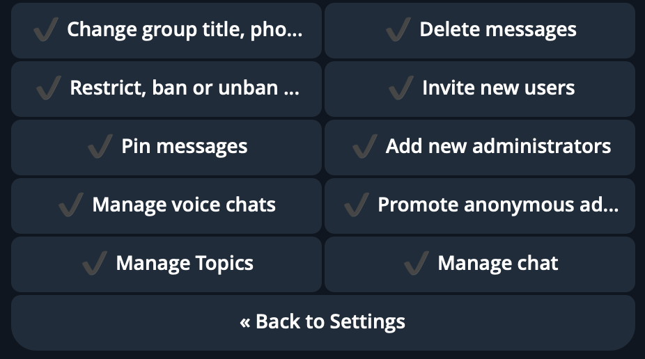
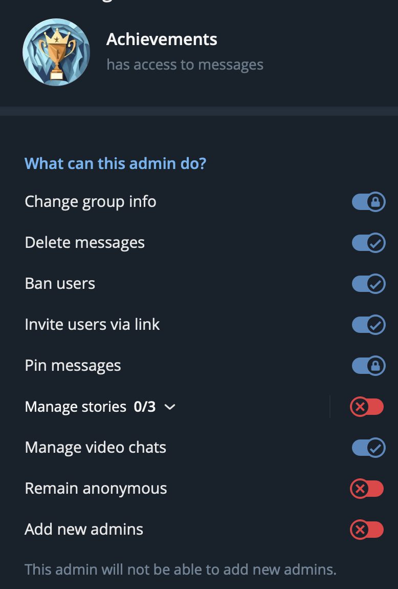
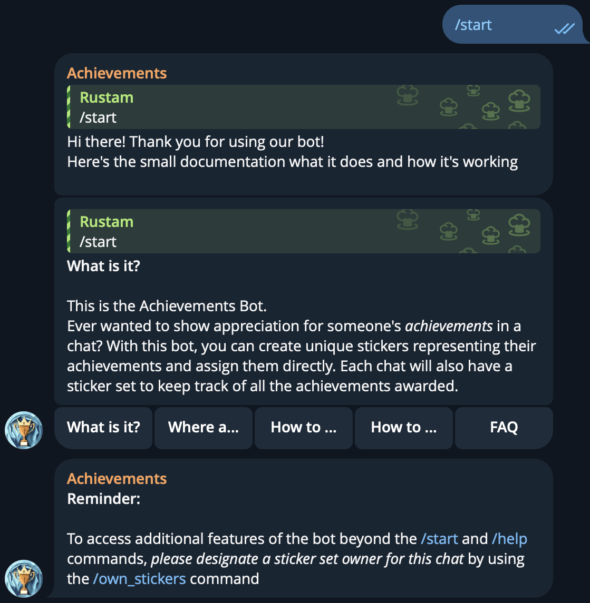
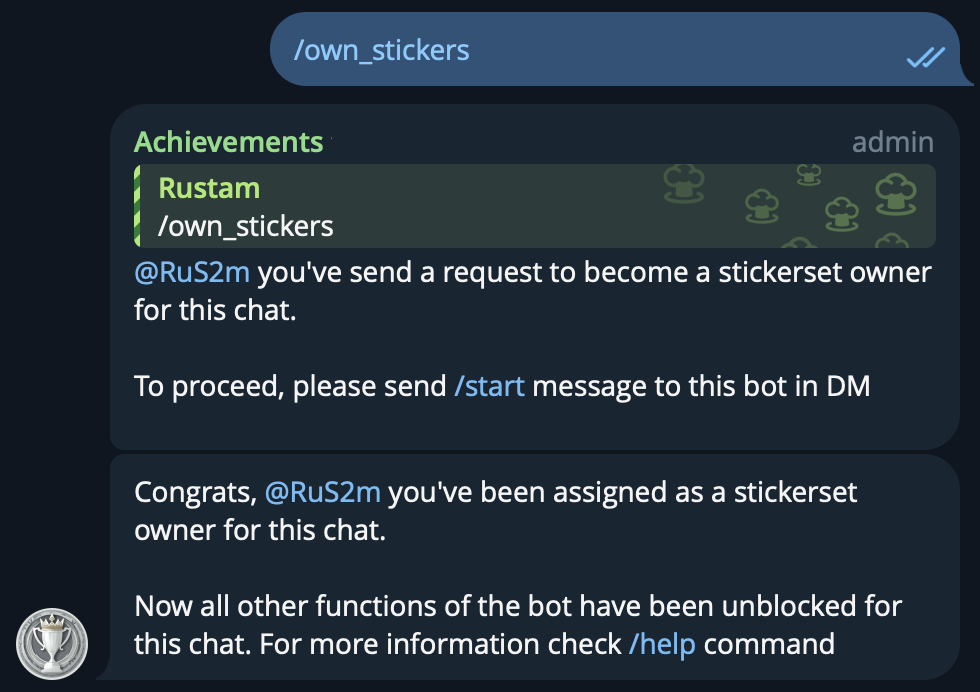
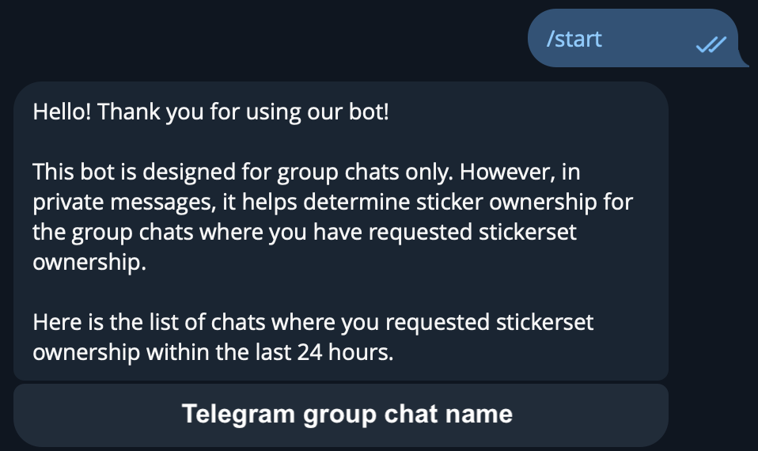
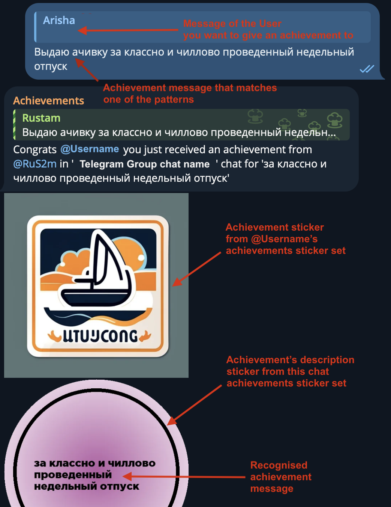
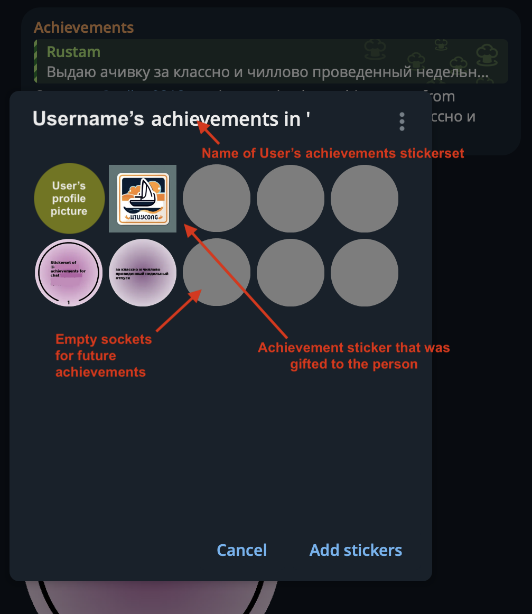
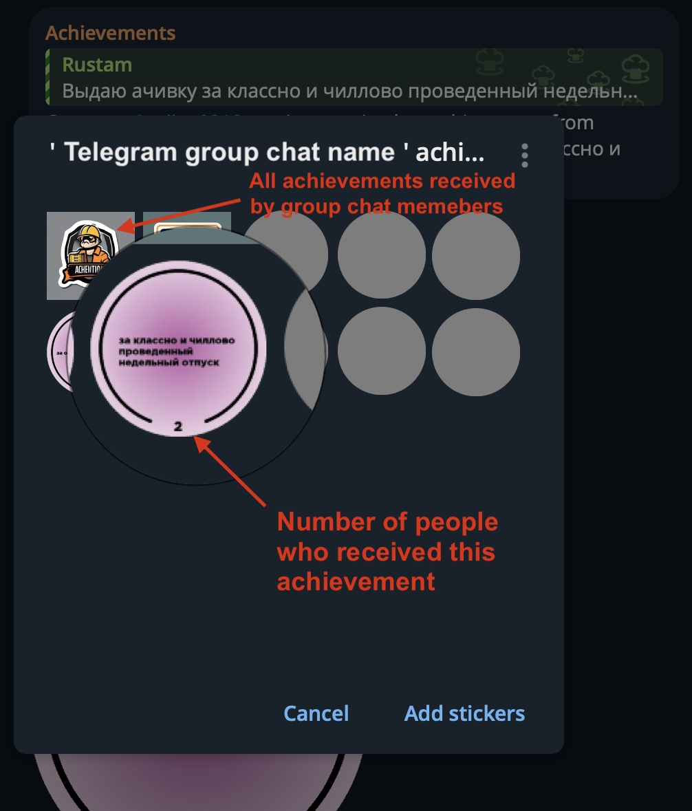

# a4iFfki Achievements Bot
  

## Introduction
The **a4iFfki Achievements Bot** for Telegram is designed to recognize and celebrate individual and group achievements within chat environments. It allows users to create and assign unique stickers that symbolize specific achievements, enhancing engagement and interaction.

## Features
- **Individual Sticker Sets:** Each Telegram user can have their own set of stickers that represent their personal achievements.
- **Group Sticker Sets:** Chats can maintain collective sticker sets to track of all achievements awarded to the chat members
- **AI-Generated Stickers:** Stickers are dynamically created with AI, based on the descriptions provided during the achievement assignment.

## Getting Started

### Bot rights
In order to work, bot has to have `Allow groups` enabled in `@BotFather` and all group admin rights enabled as well:

Additionally, the bot should be an admin in the group chat in order to have the access to all the messages and be able to answer to them:

### Bot start
Start the bot by invoking `/start` command. It will show the dynamic documentation message that's also available by `/help` command.

### Sticker Management
To begin managing stickers, a user must take ownership by sending `/own_stickers` in the chat. This user will manage both individual and group sticker sets.

After the bot asks stickerset owner candidate to send `/start` in DM messages, they should proceed with the command within 24 hours and will become a stickerset owner, unless someone would become one before them

**Important:** The owner should not alter these stickers outside of the bot commands, as it could interfere with the bot's tracking capabilities.

### Assigning Achievements
- **New Achievements:** Reply to a chat message with the trigger phrase (e.g., `выдаю ачивку за [achievement description]` or `drop an achievement for [achievement description]`, here's [the link for full list of key phrases](resources/key.txt)). The bot will process the information and add appropriate stickers to both personal and group chat sticker sets.

- **Existing Achievements:** To assign an already established achievement, reply with its corresponding achievement sticker from the group set. The system automatically updates the achievement count.

## FAQ

**Why did I receive a warning for excessive bot usage?**
- The bot operates with usage limitations to maintain budget constraints: a maximum of two achievements per person per day. Exceeding this may trigger temporary restrictions.

**What should I do if I encounter issues with the bot?**
- If the bot malfunctions or behaves unexpectedly, please report the issue through our [GitHub Issues](https://github.com/progaem/a4iFfki/issues) page. Detail the steps taken to replicate the problem, and any screenshots or logs that might help diagnose the issue.

## Development and Contributions
Interested in contributing? We encourage community contributions! Please check our [Development Guide](src/DEVELOPMENT.md) for details on how to get started.

## License
This project is licensed under the [MIT License](LICENSE). See the LICENSE file for more details.